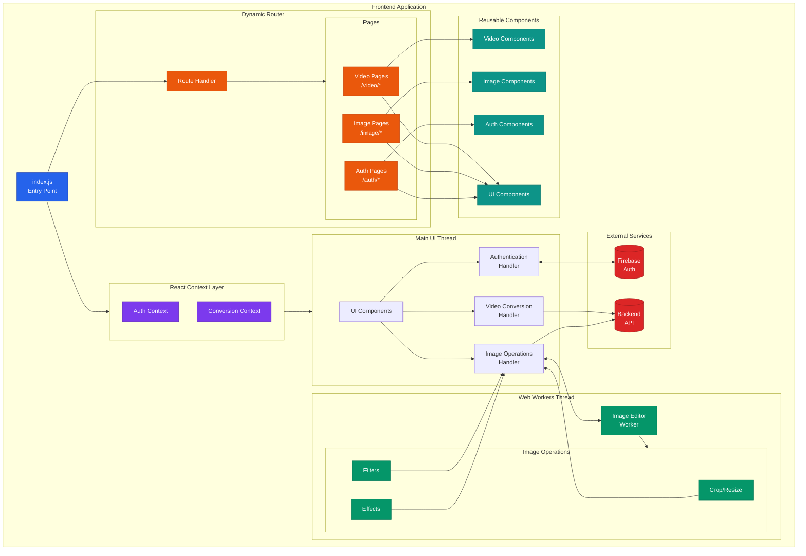

# Convert Quickly (frontend) (formerly Media Convert)

**Convert Quickly** is a web application that allows users to upload media files, convert them to different formats, and download the converted files.

Check out [Convert Quickly (backend)](https://github.com/Temidayo32/media-convert-backend)

## Video Demo

## Frontend Architecture

ConvertQuickly's frontend is built with React, utilizing modern web technologies for efficient media processing. Here's how the system is organized:

1. **Routing Structure**:
   - Dynamic routing handles different sections of the application
   - Dedicated pages for video (/video/*), image (/image/*), and authentication (/auth/*)
   - Each route renders specific page components

2. **Component Organization**:
   - Reusable components grouped by functionality
   - Video components handle video-specific features
   - Image components manage image manipulation
   - Shared UI components for common elements
   - Auth components for user management

3. **Processing Distribution**:
   - **Main Thread**: Handles UI rendering, authentication, video, and images conversion requests
   - **Web Workers**: Manages real-time image editing operations
   - Backend communication for final conversion processing

4. **State Management**:
   - React Context API manages global state
   - Authentication state handled through Firebase
   - Conversion state tracks processing status

5. **Image Processing Pipeline**:
   - Real-time editing in web workers
   - Edited images sent back to main thread
   - Final conversion requests sent to backend API

The architecture emphasizes component reusability and clear separation of concerns, with each page utilizing specific components for its functionality while sharing common UI elements.

## Features

- **Upload Media Files**: Users can upload video, image and document files from their device, Dropbox, or Google Drive.
- **Editing Media Files**: Users can use a minimalistic image editor to edit images before conversion.
- **Convert Media Files**: The app supports converting videos, image and document files to various formats.
- **Download Converted Files**: Users can download the converted files to their device.

## Technologies Used

- **Frontend**:
  - React.js
  - Tailwind CSS
  - OpenCV (Image Editing)
  -

- **Backend**:
  - Node.js
  - Express.js
  - FFmpeg (for video conversion)
  - Jimp
  - Inkscape

- **Authentication**:
  - Firebase Authentication

- **Database and Cloud Storage**
  - AWS S3
  - Firestore

## Roadmap

- **Video Converter**: Support for converting video files (e.g., MP4, MPEG) .
- **Image Converter (In Development)**: Support for converting raster and vector image files (e.g., JPG, PNG, SVG).
- **Document Converter (Coming soon)**: Support for converting document files (e.g., PDF, DOCX).
